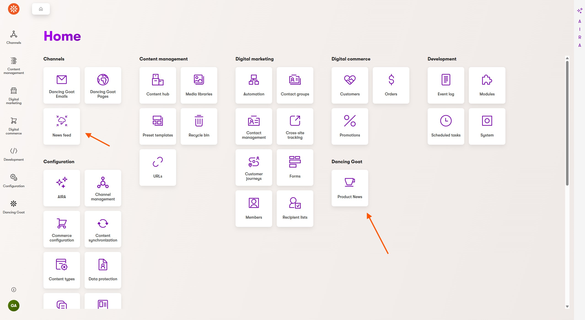
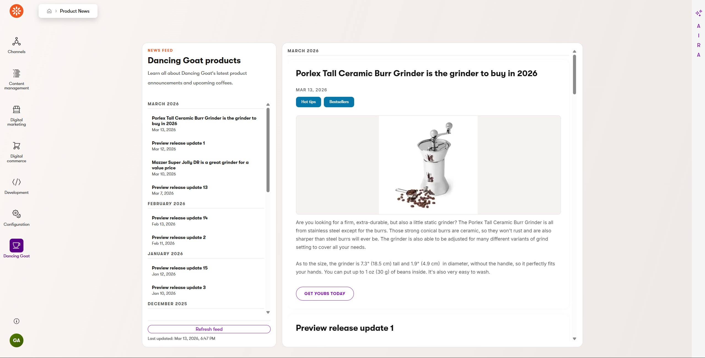
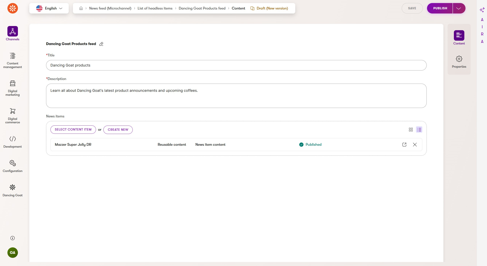

# Xperience by Kentico News Feed

[](https://github.com/Kentico/.github/blob/main/SUPPORT.md#labs-limited-support) [](https://github.com/Kentico/xperience-by-kentico-news-feed/actions/workflows/ci.yml)

## Description

An experimental integration to deliver news directly into the Xperience administration.

## Screenshots







## Requirements

### Library Version Matrix

| Xperience Version | Library Version |
| ----------------- | --------------- |
| >= 31.2.1         | 1.0.0           |

### Dependencies

- [ASP.NET Core 10.0](https://dotnet.microsoft.com/en-us/download)
- [Xperience by Kentico](https://docs.kentico.com)

### Other requirements

This integration can serve news content from any source, but it is designed to work with [Xperience by Kentico headless channels](https://docs.kentico.com/x/nYWOD). The demo project included in this repository includes an example headless channel and headless item for a news feed.

## Package Installation

Add the package to your application using the .NET CLI

```powershell
dotnet add package Kentico.Xperience.NewsFeed.Admin
```

## Quick Start

Use these minimal steps to get the integration running. For a full walkthrough and deeper customization, use [Usage Guide](./docs/Usage-Guide.md).

1. Register News Feed services in your app startup.

   Use [examples/DancingGoat/Program.cs](examples/DancingGoat/Program.cs) as reference and add:

   ```csharp
   using Kentico.Xperience.NewsFeed;
   using Kentico.Xperience.NewsFeed.Admin;

   builder.Services.AddNewsFeed<NewsFeedGraphqlService>(builder.Configuration);
   ```

1. Configure the `Kentico:NewsFeed` section in your `appsettings.json`.

   Use [examples/DancingGoat/appsettings.json](examples/DancingGoat/appsettings.json) as reference:

   ```json
   "Kentico": {
     "NewsFeed": {
       "EndpointUrl": "https://<your-headless-endpoint>/graphql/<channel-guid>",
       "FeedItemId": "<headless-item-guid>",
       "BearerToken": "<bearer-token>",
       "CacheDurationMinutes": 5
     }
   }
   ```

1. Register the admin page application attribute.

   Use [examples/DancingGoat/Program.cs](examples/DancingGoat/Program.cs) as reference:

   ```csharp
   [assembly: UICategory(
       "DancingGoat.Admin.NewsFeed.Category",
       "Dancing Goat",
       Icons.Cup,
       100)]
   [assembly: UIApplication(
       "Kentico.Xperience.NewsFeed.Admin.Application",
       typeof(NewsFeedTemplatePage),
       "<page-slug>",
       "News Feed",
       "DancingGoat.Admin.NewsFeed.Category",
       Icons.Cup,
       "@kentico/xperience-integrations-news-feed-web-admin/NewsFeed")]
   ```

   Registering these in your own application gives you full control over how they are presented.

1. Implement and register an `INewsFeedService`.

   A working example is available in [examples/DancingGoat/Services/NewsFeedGraphqlService.cs](examples/DancingGoat/Services/NewsFeedGraphqlService.cs).

1. Run your application and open Xperience admin.

   Navigate to the registered "News Feed" application page and confirm feed items are loaded.

## Full Instructions

View the [Usage Guide](./docs/Usage-Guide.md) for more detailed instructions.

## Contributing

To see the guidelines for Contributing to Kentico open source software, please see [Kentico's `CONTRIBUTING.md`](https://github.com/Kentico/.github/blob/main/CONTRIBUTING.md) for more information and follow the [Kentico's `CODE_OF_CONDUCT`](https://github.com/Kentico/.github/blob/main/CODE_OF_CONDUCT.md).

Instructions and technical details for contributing to **this** project can be found in [Contributing Setup](./docs/Contributing-Setup.md).

## License

Distributed under the MIT License. See [`LICENSE.md`](./LICENSE.md) for more information.

## Support

[](https://github.com/Kentico/.github/blob/main/SUPPORT.md#labs-limited-support)

This project has **Kentico Labs limited support**.

See [`SUPPORT.md`](https://github.com/Kentico/.github/blob/main/SUPPORT.md#full-support) for more information.

For any security issues see [`SECURITY.md`](https://github.com/Kentico/.github/blob/main/SECURITY.md).
